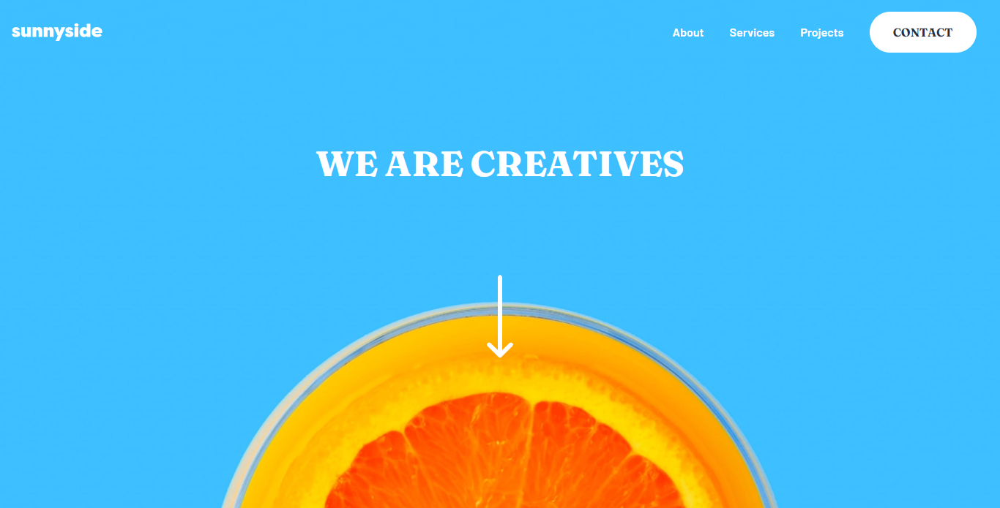

# Frontend Mentor - Sunnyside agency landing page solution

This is a solution to the [Sunnyside agency landing page challenge on Frontend Mentor](https://www.frontendmentor.io/challenges/sunnyside-agency-landing-page-7yVs3B6ef). Frontend Mentor challenges help you improve your coding skills by building realistic projects.

## Table of contents

- [Overview](#overview)
  - [The challenge](#the-challenge)
  - [Screenshot](#screenshot)
  - [Links](#links)
- [My process](#my-process)
  - [Built with](#built-with)
  - [What I learned](#what-i-learned)
  - [Useful resources](#useful-resources)
- [Author](#author)


## Overview

### The challenge

Users should be able to:

- View the optimal layout for the site depending on their device's screen size
- See hover states for all interactive elements on the page

### Screenshot


### Links
- Live Site URL: [Add live site URL here](https://plainsight16.github.io/FEM-sunnyside-agency-landing-page/)

## My process

### Built with

- Semantic HTML5 markup
- CSS custom properties
- Flexbox
- Tailwind CSS
- Mobile-first workflow
- Javascript


### What I learned

I learnt about css-clip-path used for editing elements into shapes.

To see how you can add code snippets, see below:


```css
.nav-links::before{
    content:"";
    position:absolute;
    top:-24px;
    right:0;
    background-color: white;
    width:1.5rem;
    height:1.5rem;
    clip-path: polygon(0 0, 0 100%, 100% 100%);
    transform:scaleX(-1);
}
```


If you want more help with writing markdown, we'd recommend checking out [The Markdown Guide](https://www.markdownguide.org/) to learn more.


### Useful resources

- [Example resource 1](https://www.csstricks.com) - This helped me to understand clip-path. I'd recommend it to anyone still learning this concept. 
- [Example resource 2](https://www.codegrepper.com) - This is an amazing site which helped me finally understand how to mirror a div.


## Author
- Frontend Mentor - [@plainsight16](https://www.frontendmentor.io/profile/plainsight16)


